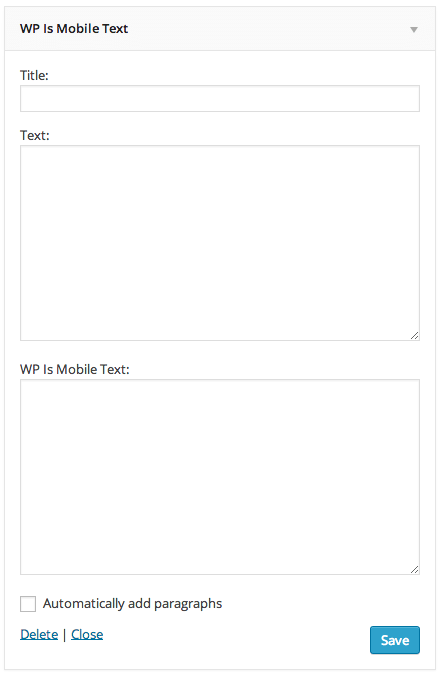

# Introducing WP Is Mobile Text Widget

This WordPress plugin adds text widget that switched display text using wp_is_mobile() function whether the device is mobile or not.

## Installation

1. Download and unzip files. Or install wp-is-mobile-text-widget using the WordPress plugin installer. In that case, skip 2.
2. Upload "wp-is-mobile-text-widget" to the "/wp-content/plugins/" directory.
3. Activate the plugin through the 'Plugins' menu in WordPress.
4. Add the 'WP Is Mobile Text' widget to a widget area and configure settings through the 'Widgets' menu in WordPress.
5. Have fun!

## Changelog

* Version 1.0.0
	* initial release.
